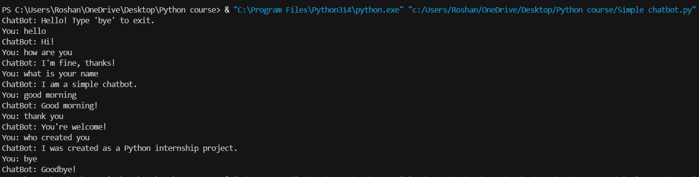
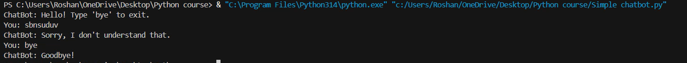

# Basic Chatbot

## Overview

This project is a simple rule-based chatbot developed using Python. It responds to predefined user inputs such as greetings, questions, and farewell messages.

## Features

- Greeting responses
- Basic conversation handling
- Predefined questions and answers
- Exit command using "bye"
- Interactive console application

## Technologies Used

- Python

## Test Inputs

- hello
- how are you
- what is your name
- good morning
- thank you
- who created you
- bye

## Concepts Used

- Functions
- Loops
- If-Elif-Else Statements
- User Input Handling
- String Manipulation

## Author

Roshan Seerwani

## Screenshots

### Test Case 1 - Valid Chatbot Responses

### Test Case 2 - Unknown Input Handling

